# ReKOGAN
## Introduce
ReKOGAN은 한글 손글씨 이미지를 생성하는 AI 프로젝트이다.
 (여기서 "Re"는 한번 망했다가 다시 진행했기에 붙인 것)
 
 GAN은 Generator과 Discriminator의 적대적 학습을 통해 훈련하는 생성형 인공지능의 종류 중 하나이다.
 
 

 
 Generator가 생성하면 그 생성된 것이 Real인지 Fake인지 Discriminator가 판단한다.
 이를 반복하며 Generator가 Real을 더 잘 생성할 수 있도록 학습하는 방법이 GAN이다.
 
 이 프로젝트에서는 GAN을 통해 생성할 대상을 "한글 손글씨"로 한다.
 이 때, 총 520가지의 한글 문자 종류를 생성할 것이기에 GAN 중에서도 cGAN을 사용한다.
 cGAN은 External Information을 train중에 받는데 여기서 external info는 label에 해당된다.
 
## Datasets
이 프로젝트에 사용된 데이터셋은 callee2006의 HangulDB 중 SERI이다. (https://github.com/callee2006/HangulDB)
 SERI는 가장 빈번히 사용되는 한글 520글자 각각 900개의 손글씨 이미지로 구성되어 있다.
 이에 대한 label은 EUC-KR방식을 사용하였다.
 ex) b0a1 -> 가
 
## Train
학습은 epochs 100, batch 128로 진행하였고 각 epoch마다 '가'이미지 샘플을 만들어 저장하였다.
 
 
| | | | | | | | | | |
|:---:|:---:|:---:|:---:|:---:|:---:|:---:|:---:|:---:|:---:|
| 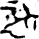 | 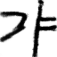 | 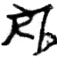 | 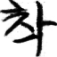 | 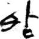 | 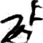 | 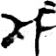 | 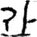 | 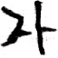 | 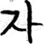 |
| 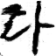 | 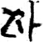 | 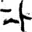 | 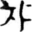 | 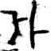 | 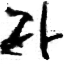 | 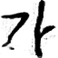 | 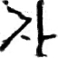 | 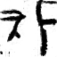 | 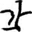 |
| 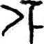 | 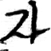 | 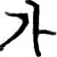 | 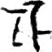 | 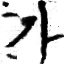 | 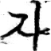 | 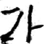 | 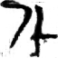 | 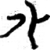 | 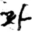 |
| 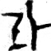 | 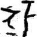 | 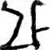 | 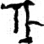 | 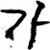 | 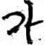 | 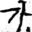 | 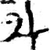 | 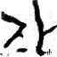 | 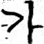 |
| 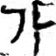 | 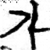 | 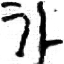 | 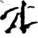 | 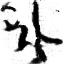 | 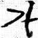 | 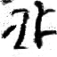 | 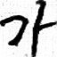 | 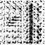 | 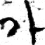 |
| 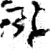 | 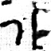 | 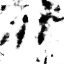 | 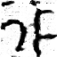 | 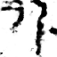 | 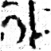 | 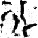 | 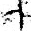 | 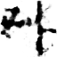 | 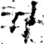 |
| 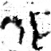 | 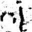 | 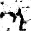 | 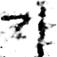 | 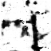 | 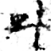 | 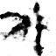 | 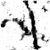 | 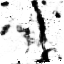 | 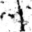 |
| 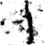 | 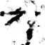 | 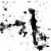 | 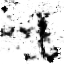 | 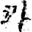 | 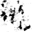 | 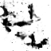 | 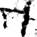 | 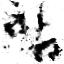 | 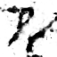 |
| 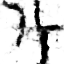 | 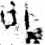 | 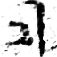 | 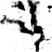 | 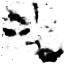 | 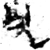 | 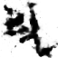 | 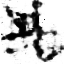 | 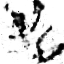 | 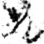 |
| 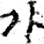 | 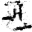 | 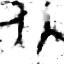 | 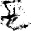 | 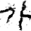 | 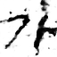 | 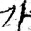 | 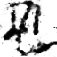 | 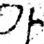 | 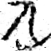 |

왼쪽 위가 epoch1 오른쪽 아래가 epoch100
 
 이를 보면 초중반에는 학습이 진행되다가 후반에는 노이즈가 낀 것처럼 이미지가 명확하지 않아진다.
 또한 후반부로 갈수록 '가'와 다른 '차', '핀', '긴'등과 가까워 보이는 이미지가 생성되고 있다.
 
 이를 기반으로 Mode Collapse, Conditional Mode Collapse, Label Collapse 등이 일어났다는 것을 유추할 수 있다.
 이러한 Collapse들은 생성자가 판별자를 속이기 위한 쉬운 길을 찾으며 발생한다.
 
 그나마 생성을 잘 한것 같은 epoch8의 모델을 불러와 생성을 해보면

| | | |
|:---:|:---:|:---:|
|  |  | 

