# ReKOGAN
## Introduce
ReKOGAN은 한글 손글씨 이미지를 생성하는 AI 프로젝트이다.
 (여기서 "Re"는 한번 망했다가 다시 진행했기에 붙인 것)
 
 GAN은 Generator과 Discriminator의 적대적 학습을 통해 훈련하는 생성형 인공지능의 종류 중 하나이다.
 
 

 
 Generator가 생성하면 그 생성된 것이 Real인지 Fake인지 Discriminator가 판단한다.
 이를 반복하며 Generator가 Real을 더 잘 생성할 수 있도록 학습하는 방법이 GAN이다.
 
 이 프로젝트에서는 GAN을 통해 생성할 대상을 "한글 손글씨"로 한다.
 이 때, 총 520가지의 한글 문자 종류를 생성할 것이기에 GAN 중에서도 cGAN을 사용한다.
 cGAN은 External Information을 train중에 받는데 여기서 external info는 label에 해당된다.
 
# 1차 시도
## Datasets 
AI-hub의 한국어 글자체 이미지
 └── 01.손글씨
 　　　├── 01_handwriting_syllable_images.zip
 　　　└── 02_handwriting_syllable_images.zip
 총 약 73만개의 이미지, 11,172개의 글자 종류
 데이터셋이 너무 방대해서 레이블 정보를 담은 json 파일도 제대로 열리지 않을 정도였다.
 레이블은 한글 원래 글자로 이미지와 글자를 1대1로 대응시킨 json 파일로 하였다.
 
## Train
데이터셋이 너무 방대해서 epoch를 100으로 한 훈련에도 약 1.5일 가량이 소모되었다.
 
 
 그 당시에 생성했던 '가'이다.
 
 결과가 매우 처참해서 epoch를 300으로 늘려 약 2일 가량 추가 학습을 시켰다.
 
 
 추가 학습을 진행해 epoch 300으로 생성한 '가'이다.
 
 마찬가지로 '가'와 전혀 닮지도, '가'의 특징 중 일부가 드러나고 있지도 않았다.
 이에 문제점을 느끼고 손실 함수 히스토리를 작성하도록 해보았더니
 
 
 다음과 같은 결과가 출력되었다.
 
 중간 중간에 손실이 매우 커지는 것이 1차적으로 보이는 문제였다.
 이를 통해 '가'의 출력 결과가 '가'와 닮지 않았고, 손실이 갑자기 커지는 문제가 발생하고 있음을 알 수 있었다.
 
 이를 해결하기 위해서 그냥 처음부터 프로젝트를 갈아엎고 다시 시작하기도 정했다.
 이렇게 판단한 이유는 일단 데이터셋이 너무 커서 condition 값이 제대로 할당이 되지 않았을 수도 있다는 것이 가장 큰 이유였다.
 엄청나게 큰 데이터셋을 임의로 축소하고 조정하는 것 보다는 그냥 적당한 크기의 데이터셋을 새로 구한 뒤, 추가 조치를 하는 것이 더 효율적이라고 판단했다.
 따라서 1차 시도는 실패하고 완전히 처음부터 다시 시작하게 되었다.
 
# 2차 시도
## Datasets
2차 시도에서 사용한 데이터셋은 callee2006의 HangulDB 중 SERI이다. (https://github.com/callee2006/HangulDB)
 SERI는 가장 빈번히 사용되는 한글 520글자 각각 900개의 손글씨 이미지로 구성되어 있다.
 이에 대한 label은 EUC-KR방식을 사용하였다.
 ex) b0a1 -> 가
 
## Train
학습은 epochs 100, batch 128로 진행하였고 각 epoch마다 '가'이미지 샘플을 만들어 저장하였다.
 
 
| | | | | | | | | | |
|:---:|:---:|:---:|:---:|:---:|:---:|:---:|:---:|:---:|:---:|
|  |  |  |  |  |  |  |  |  |  |
|  |  |  |  |  |  |  |  |  | 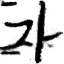 |
|  |  |  |  |  |  |  |  |  |  |
|  |  |  |  |  |  |  |  |  |  |
|  |  |  |  |  |  |  |  |  |  |
|  |  |  |  |  |  |  |  |  |  |
|  |  |  |  |  |  |  |  |  |  |
|  |  |  |  |  |  |  |  |  |  |
|  |  |  |  |  |  |  |  |  |  |
|  |  |  |  |  |  |  |  |  |  |

왼쪽 위가 epoch1 오른쪽 아래가 epoch100
 
 이를 보면 초중반에는 학습이 진행되다가 후반에는 노이즈가 낀 것처럼 이미지가 명확하지 않아진다.
 또한 후반부로 갈수록 '가'와 다른 '차', '핀', '긴'등과 가까워 보이는 이미지가 생성되고 있다.
 
 이를 기반으로 Mode Collapse, Conditional Mode Collapse, Label Collapse 등이 일어났다는 것을 유추할 수 있다.
 이러한 Collapse들은 생성자가 판별자를 속이기 위한 쉬운 길을 찾으며 발생한다.
 
 그나마 생성을 잘 한것 같은 epoch8의 모델을 불러와 생성을 해보면

| | | |
|:---:|:---:|:---:|
|  |  | 

순서대로 '가', '다', '각'을 생성한 결과이다.
 잘 생성되는 문자도 있지만, 그렇지 않은 문자도 있는 것이 확인된다.
 이는 곧 Conditional Mode Collapse, Label Collapse이 일어났을 가능성을 높여준다.
 아마도 이러한 문제는 각 글자마다 특성의 명확도(규칙성 등)이 다르기 때문에 일어났을 것으로 보인다.
 또는 생성자 혹은 판별자가 상대에 비해 너무 빠르게 발전해서 두 모델 사이의 불균형으로 인해 발생했을 수 있다.
 
 나는 이러한 문제를 해결하기 위해서 확률과 통계, 영어 독해 연습 시간에 책, 논문을 읽으며 문제를 해결할 방법을 생각해보았다.
 또한 어딘가 잘못된 부분이 있지는 않은지 확인하기 위해서 코드 전체를 검토하며 문제점을 찾고자 했다.
 
# 3차 시도 - 해결
## Datasets
데이터셋은 이전의 callee2006의 HangulDB 중 SERI에 각 글자당 600개의 추가 이미지를 더해 구성했다.
 
## Train
데이터셋의 수를 늘린 이유는 영어 독해 연습 시간에 읽은 논문(Collapse by Conditioning: Training Class-conditional GANs with Limited Data)에서 데이터가 적으면 cGAN에서 GAN보다 Collapse가 발생하기 쉽다고 해서 데이터셋을 늘려 이를 해결하려 했다.
 또한 2차 시도 후반에서 코드 전체를 살펴보며 문제점을 찾으려 했다고 언급했다.
 그 결과, 치명적인 실수를 발견했다.
 
 바로 condition 값의 차원이 부족하다는 것이다.
 condition 값은 cGAN에서 클래스, 레이블을 구분해 주기 위한 요소로 이 condition 값이 잘 설정되어야 올바른 학습이 가능하다.
 하지만 나는 초기에 condition 값의 차원을 임의로 10 정도로 설정하여 520개의 글자 종류의 condition을 모두 설정할 수 없었다.
 따라서 어떤 condition 값에는 2개 이상의 글자가 할당되었을 수 있다.
 이는 곧 출력 결과에서 특정 글자의 특징이 보이지 않고 다른 글자가 생성되는 듯한 영향을 줄 수 있다.
 이를 노골적으로 보여주는 결과가 2차 시도의 Train 부분에서 후반부로 갈수록 다른 글자가 생성되는 부분이다.
 아마 2차 시도에서는 한 condition 값에 '가'와 '긴' 등이 할당되어 초반에는 '가'에 가까웠다가 후반에 '긴'의 영향력이 강해지며 '긴'에 가까워진 것으로 추정된다.
 
 따라서 condition의 차원을 50으로 충분히 늘려준 뒤 epoch 100으로 학습을 진행했다.
 
 

| | | | | | | | | | |
|:---:|:---:|:---:|:---:|:---:|:---:|:---:|:---:|:---:|:---:|
| 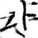 |  |  | 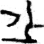 |  |  | 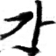 |  |  | 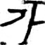 |
|  |  | 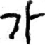 |  | 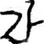 | 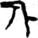 | 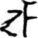 |  |  |  |
|  |  |  |  | 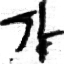 | 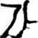 | 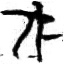 |  |  | 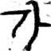 |
|  |  |  |  |  |  |  | 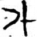 |  |  |
|  |  |  | 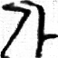 | 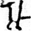 |  | 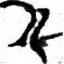 |  |  |  |
| 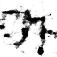 | 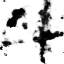 |  |  |  |  |  |  |  |  |
| 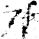 | 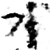 | 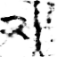 |  | 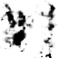 |  |  |  | 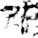 |  |
| 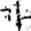 |  |  |  |  |  |  |  | 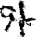 |  |
|  | 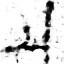 |  |  | 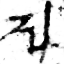 |  |  | 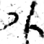 |  |  |
|  |  |  | 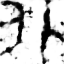 |  |  |  |  |  |  |

왼쪽 위가 epoch1 오른쪽 아래가 epoch100
 
 그 결과, 다음과 같이 끝까지 '가'의 특징이 잘 남아있는 것을 알 수 있다.
 여기서 특징성 있는 일부 epoch만을 파일에 올려두었다. (1, 10, 13, 22, 29, 42, 46, 49, 96, 100)

| | | | | | | | | | |
|:---:|:---:|:---:|:---:|:---:|:---:|:---:|:---:|:---:|:---:|
|  |  |  |  |  |  |  |  |  |  |
1|10|13|22|29|42|46|49|96|100
